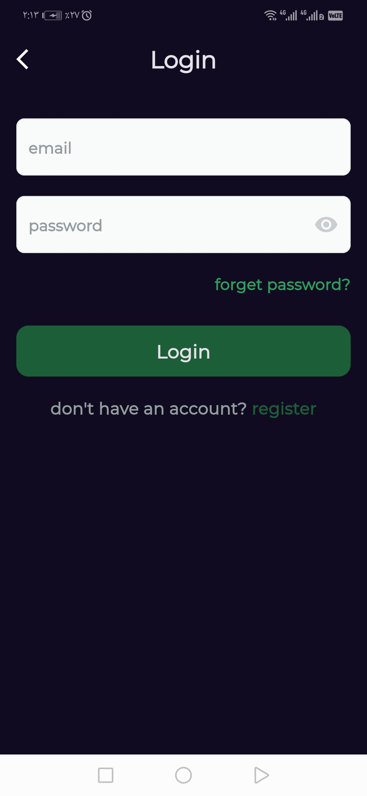
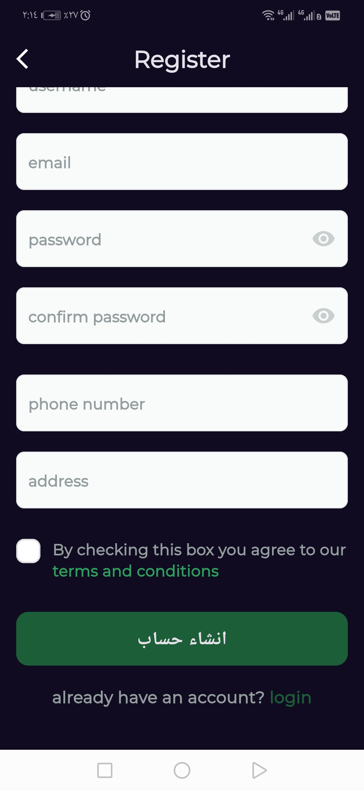
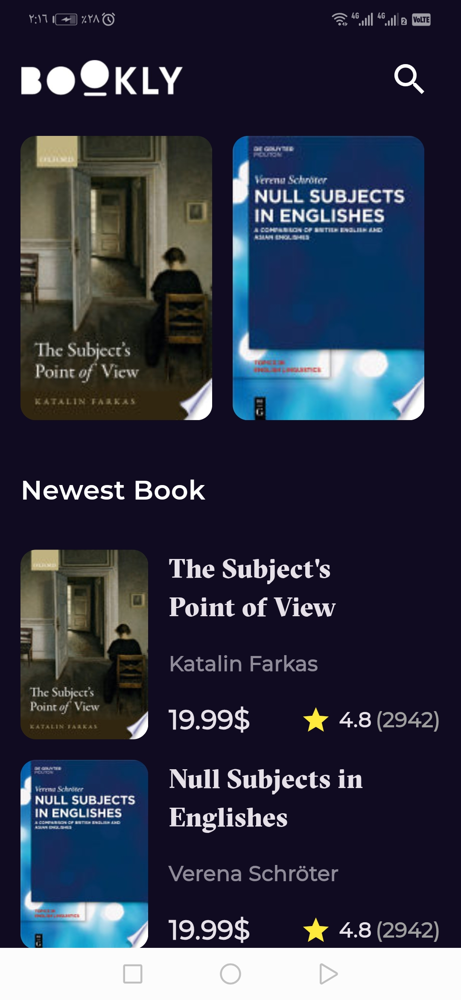
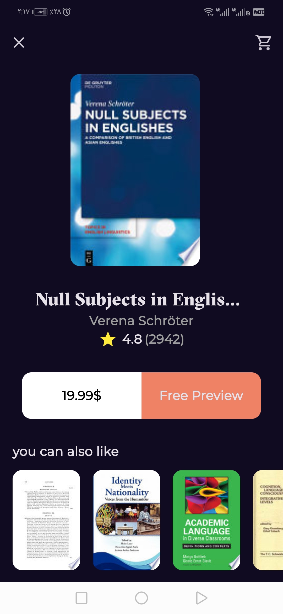
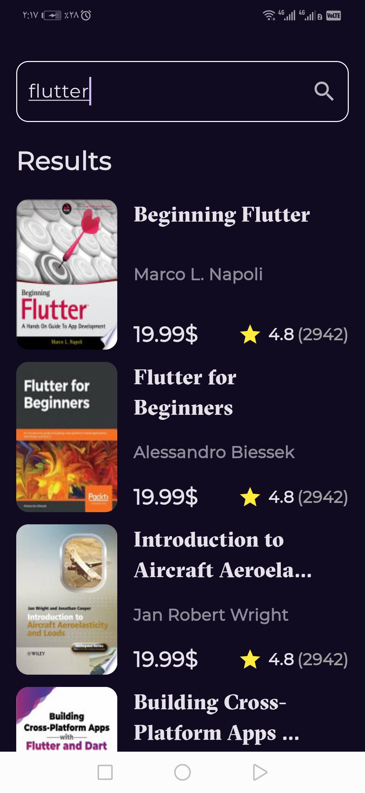

# ✅ Bookly - Book Discovery App 

  
  


A simple and user-friendly **Flutter** application designed to help users discover and search for books with ease. Features secure **authentication**, API integration for live book data, and mvvvm architecture using **Cubit** and **SetState** for state management.

---

---

## 🚀 Features

- 🔐 **Secure Authentication**  
  - Login & registration with backend integration

- 📚 **Book Collection**  
  - Fetches books from an external API using GET requests

- 🔍 **Book Search**  
  - Search functionality to find books by title

- 🧼 **MVVM Architecture**  
  - Separated layers and organized codebase

- ⚙️ **State Management**  
  - Combination of `Cubit` and `setState` for efficient state handling

---

## 📸 Screenshots

<div align="center">




<br><br>




<br><br>




</div>

---

## 🛠️ Tech Stack

- **Framework**: [Flutter](https://flutter.dev/)
- **Language**: Dart
- **State Management**: `Cubit`, `setState`
- **API**: REST (GET requests)
- **Authentication**: Backend-integrated login/register
- **Architecture**: MVVM
- **Platform**: Android / iOS

---

## 📦 Installation

To run this app locally:

```bash
# Clone the repository
git clone https://github.com/AhmedNasser24/Bookly_App.git

# Navigate into the project directory
cd Bookly_App

# Get dependencies
flutter pub get

# Run the app on a device or emulator
flutter run

- [Lab: Write your first Flutter app](https://docs.flutter.dev/get-started/codelab)
- [Cookbook: Useful Flutter samples](https://docs.flutter.dev/cookbook)

For help getting started with Flutter development, view the
[online documentation](https://docs.flutter.dev/), which offers tutorials,
samples, guidance on mobile development, and a full API reference.
